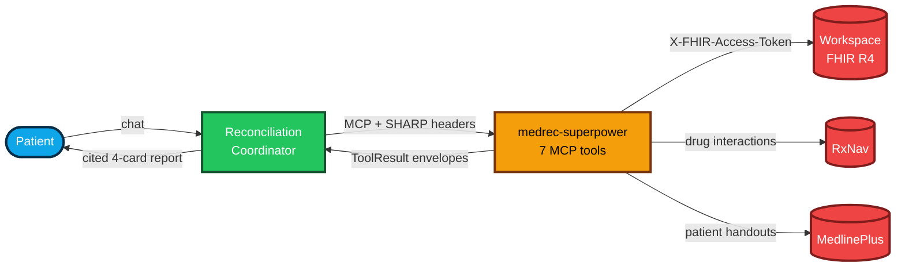
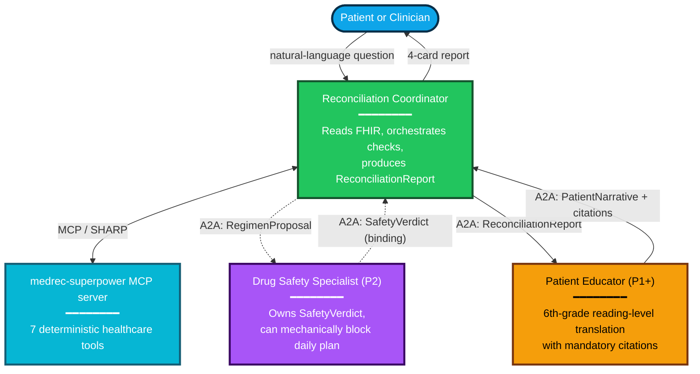
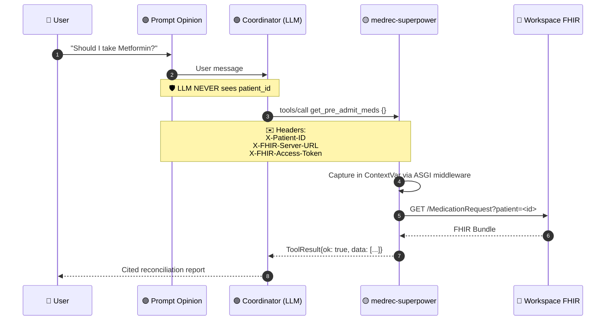
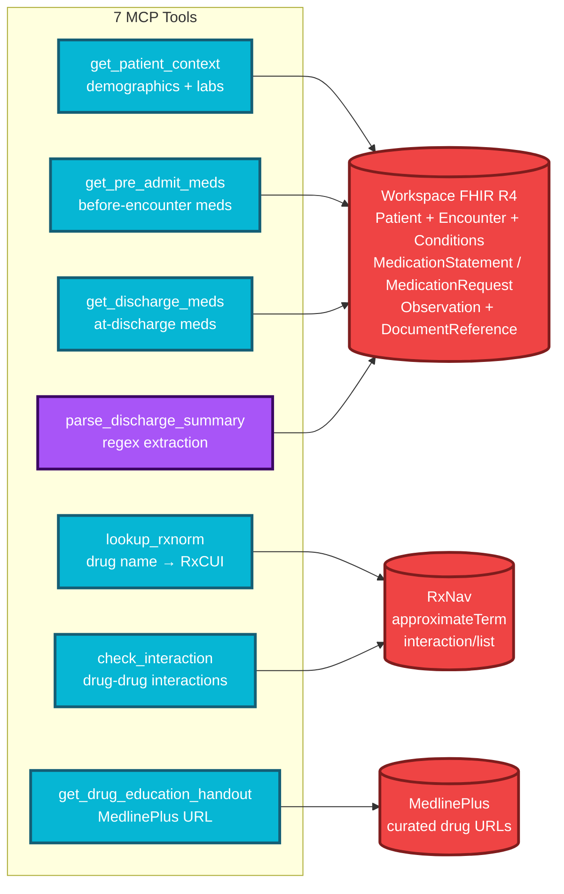
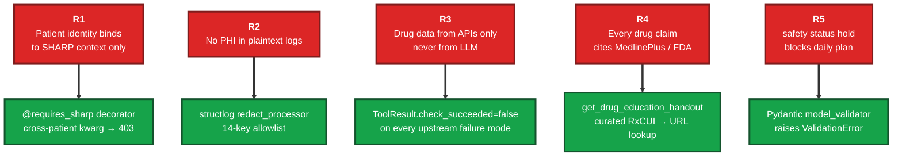

# medrec-superpower

**Post-discharge medication reconciliation, built so it cannot hallucinate.**

A healthcare AI system on the [Prompt Opinion](https://promptopinion.ai) platform. Multi-agent. Open standards. Drug data only from authoritative APIs — never from the model.

[](#tests)
[](#tests)
[](#mcp-tools)
[](#standards)
[](#standards)
[](#run-it)

> Built for **Agents Assemble — The Healthcare AI Endgame** hackathon (Prompt Opinion / Darena Health, 2026).

---

## Why this matters

| | |
|---|---|
| 🏥 | **1 in 5 patients makes a medication error in the week after hospital discharge.** Confusion about what to keep, stop, or restart drives readmissions. |
| 🤖 | An LLM that hallucinates *one* drug interaction is worse than no AI at all in healthcare. |
| 🔓 | Open standards — **MCP** for tools, **A2A** for agents, **FHIR R4** for data, **SMART scopes** for authorization — keep this portable across every EHR. |
| 🛡️ | Our 5 mechanical safety rules (R1–R5) make hallucination structurally impossible, not just unlikely. |

---

## How it works (60-second tour)

A patient asks **"Should I still be taking my Metformin?"** Behind the scenes:



The Coordinator never sees the patient's identity, never composes a drug fact, never writes a URL. Everything comes from authoritative sources via deterministic tools.

---

## Architecture at a glance

### 1. The agent system

Three agents, each with bounded authority:



**Authority boundaries are real.** The Specialist's `status="hold"` mechanically blocks the daily plan via a Pydantic validator (R5). The Educator never sees raw FHIR data — only the structured report.

### 2. SHARP identity propagation

Patient identity never touches the LLM. Prompt Opinion injects FHIR credentials as HTTP headers; the MCP server reads them server-side; tools call back into the workspace FHIR server with the bearer token.



The agent's tool signature is literally `get_pre_admit_meds()` — **zero arguments**. There is no patient ID for the LLM to fabricate. (R1, mechanical.)

### 3. The MCP tool layer

Seven tools, each backed by an authoritative source. The LLM picks tools by name; data never round-trips through model knowledge.



### 4. The 5 safety rules — mechanically enforced

Not vibes. Not prompt-engineering. Code that physically cannot return a value violating these:



Each box on the right is a few lines of code. Each rule on the left is a guarantee a regulator can verify.

---

## Standards

| Layer | Standard | Why it matters |
|---|---|---|
| Tool protocol | [**MCP**](https://modelcontextprotocol.io) | Any compliant agent can use our tools without custom glue. |
| Agent protocol | [**A2A**](https://google.github.io/A2A/) | Multi-agent orchestration without bespoke bridges. |
| Clinical data | **FHIR R4** | Every modern EHR speaks it — portable from day one. |
| Authorization | **SMART scopes** | `patient/Patient.rs`, `patient/MedicationRequest.rs`, etc. The user grants exactly what's needed; we ask for nothing more. |
| Identity | [**SHARP-on-MCP**](https://www.sharponmcp.com/) | Prompt Opinion injects identity via HTTP headers — our MCP capability `ai.promptopinion/fhir-context` declares the scopes we need. |

---

## Run it

```bash
# 1. Install + generate dev keypair
uv sync --extra dev
uv run python scripts/dev_keypair.py

# 2. Start the server (loopback by default)
uv run python -m medrec_superpower

# 3. Verify
curl http://127.0.0.1:8765/healthz

# 4. Expose for Prompt Opinion
ngrok http 8765

# 5. Generate the demo FHIR bundle (upload to Prompt Opinion workspace)
uv run python scripts/export_demo_fhir_bundle.py
# → demo/p123_fhir_bundle.json
```

See [`docs/build/BUILD.md`](docs/build/BUILD.md) for the full Prompt Opinion onboarding playbook.

## Tests

```bash
make ci          # full local replica of CI
uv run pytest    # 190 tests, 85% coverage, gate enforced
```

| Gate | Status |
|---|---|
| `ruff check` | ✅ |
| `ruff format --check` | ✅ |
| `mypy --strict` | ✅ (27 source files) |
| `pytest` | ✅ 190/190 |
| coverage | ✅ 85.26% (gate 85%) |
| `pip-audit --strict` | ✅ no known vulnerabilities |
| `bandit` | ✅ |
| schema-export drift | ✅ |

---

## What's where

| You want to… | Start here |
|---|---|
| Run the server locally | [`docs/build/BUILD.md`](docs/build/BUILD.md) |
| Record the demo video | [`docs/build/DEMO.md`](docs/build/DEMO.md) |
| Understand the agent topology | [`docs/design/AGENTS.md`](docs/design/AGENTS.md) |
| Understand the MCP tools | [`docs/design/MCP_SERVER.md`](docs/design/MCP_SERVER.md) |
| Understand SHARP context flow | [`docs/design/SHARP_CONTEXT.md`](docs/design/SHARP_CONTEXT.md) |
| Understand the safety rules | [`docs/design/SAFETY.md`](docs/design/SAFETY.md) |
| Work in this repo with Claude Code | [`CLAUDE.md`](CLAUDE.md) |

---

## The non-negotiable rules

Stated bluntly. Restated everywhere. Mechanically enforced.

1. **Drug data NEVER from the LLM.** RxNav / openFDA / MedlinePlus only. Tool fails → say so. Never substitute. *(R3)*
2. **`patient_id` from SHARP only.** Never from LLM-controlled arguments. Cross-patient access → HTTP 403. *(R1)*
3. **No PHI in plaintext logs.** Every structured log field passes through the redaction allowlist. *(R2)*
4. **`status="hold"` → no daily plan.** Pydantic validator raises `ValidationError`. *(R5)*
5. **Every patient-facing drug claim cites MedlinePlus or FDA.** URLs come from a deterministic resolver, never from the model. *(R4)*

---

## Repository layout

```
medrec_superpower/
├── server.py                ← FastMCP + FastAPI; SHARP middleware; capability extension
├── tools/                   ← One file per MCP tool (7 files)
├── fhir/
│   ├── fixture_loader.py    ← dev path (Synthea JSON)
│   └── po_client.py         ← Prompt Opinion workspace FHIR client
├── drug/
│   ├── rxnav.py             ← RxNav: interactions + approximateTerm
│   └── medlineplus.py       ← Curated RxCUI → MedlinePlus URLs
├── sharp/
│   ├── jwt.py               ← RS256 token validation (dev path)
│   ├── headers.py           ← ASGI middleware: X-FHIR-* → ContextVar
│   ├── extensions_middleware.py  ← capabilities.extensions ↔ experimental
│   └── redact.py            ← PHI redaction processor for structlog
└── schemas.py               ← Pydantic v2 models (single source of truth)

agents/
├── coordinator/             ← Reconciliation Coordinator (P0)
├── patient_educator/        ← Patient Educator (P1+)
└── schemas/                 ← Exported JSON Schemas

demo/
└── p123_fhir_bundle.json    ← Upload to Prompt Opinion to populate workspace

docs/
├── design/                  ← Why & how
├── build/                   ← Run, deploy, demo
└── reference/               ← External APIs, risks
```

---

## License

MIT. Built by [@Rayyan9477](https://github.com/Rayyan9477).
