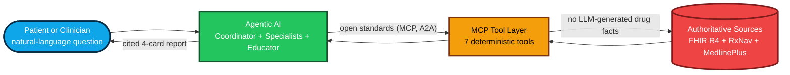
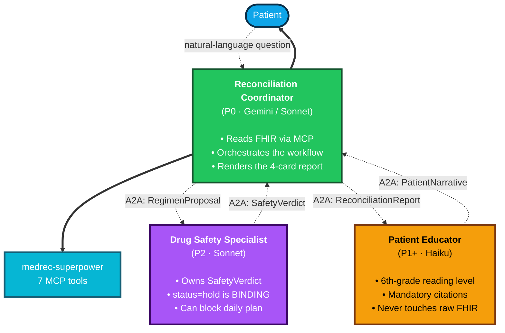
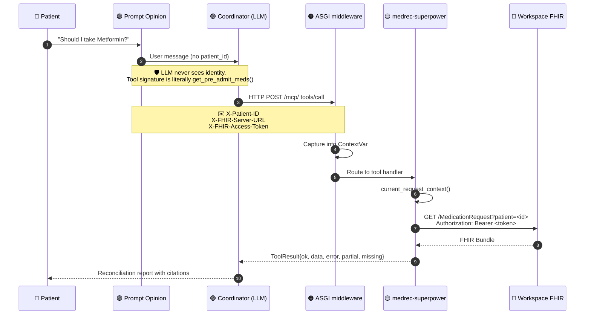
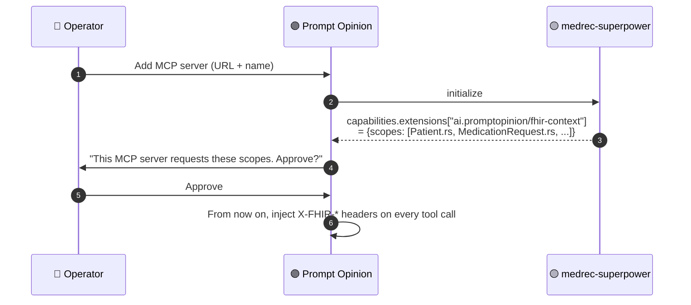
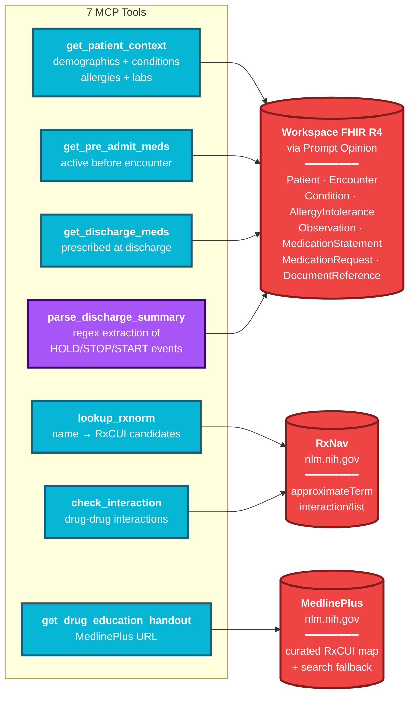
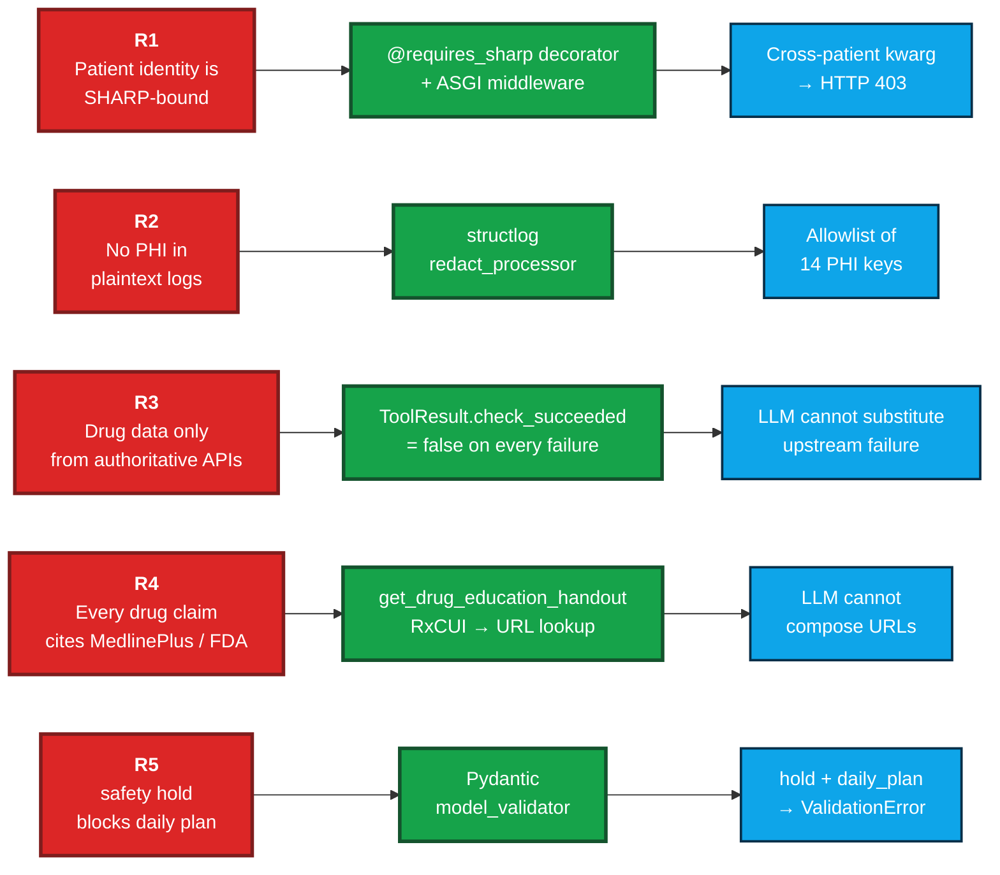
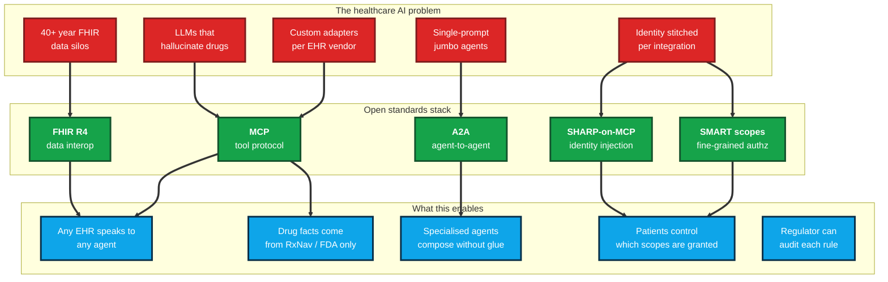
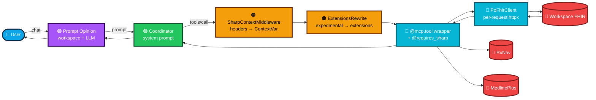

# Architecture diagrams

High-contrast Mermaid renders, suitable for the demo deck, the README, and the
Devpost submission. Each section answers one question.

---

## 1. What does this project do?

Patient → multi-agent system → cited reconciliation report. Drug data never
originates in the model.



### Why agents + MCP + FHIR matters for healthcare AI

| Concern | Without open standards | With this architecture |
|---|---|---|
| **Hallucinated drug facts** | "Trust the model" → unsafe at scale | Tools return structured envelopes; model never composes drug facts |
| **EHR integration** | One-off Epic / Cerner / Athena adapters | Speak FHIR R4 once; every workspace works |
| **Identity & consent** | Bespoke token handling per integration | SHARP-on-MCP + SMART scopes = the same primitive every agent uses |
| **Multi-step clinical workflow** | A single jumbo prompt with everything | A2A handoffs: Coordinator → Specialist → Educator, each with bounded authority |
| **Regulatory defensibility** | "We tested it" | Each safety rule is a Pydantic validator or middleware — auditable |

---

## 2. The multi-agent system



**Authority boundaries are real, not aspirational:**

- Specialist's `SafetyVerdict.status="hold"` → Coordinator's `ReconciliationReport`
  Pydantic validator refuses to construct the report with a daily plan. (R5)
- Educator only consumes the structured report — never sees raw FHIR or PHI.
- Coordinator is the only agent that may call MCP tools that touch patient data.

---

## 3. SHARP context propagation

How identity flows without the LLM ever seeing it.



**Capability handshake** (one-time at MCP server registration):



---

## 4. The MCP tool layer

7 tools, 3 authoritative sources, 0 LLM-originated drug facts.



**Every tool returns the same envelope:**

```python
ToolResult[T] {
    ok: bool                  # success XOR error
    data: T | None
    error: ErrorEnvelope | None
    partial: bool             # data may be incomplete (e.g. missing labs)
    missing: list[str]        # field names absent from data
}
```

`ok_xor_error` is a Pydantic model_validator. The model can't return
`ok=true, error=present` — it raises a `ValidationError` before the value
crosses the MCP boundary.

---

## 5. The 5 safety rules, mechanically enforced

Each rule is a piece of code, not a vibe.



---

## 6. Why open standards matter for healthcare AI



---

## 7. Request → response, one frame

The full path of a single tool call, end to end.



**Every box is testable in isolation.** That's why the test suite hits 85%
coverage without contrived stubs — each layer has a clean contract with the
next.
